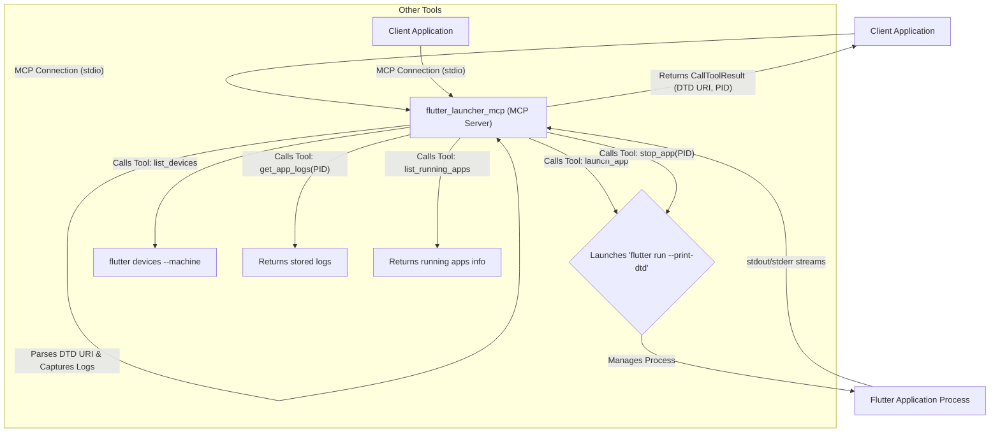

# Design Document: `flutter_launcher_mcp`

## Overview

This document describes the design of the Dart package, `flutter_launcher_mcp`, which exposes a Model Context Protocol (MCP) server. This server provides a tool to launch Flutter applications, manage their processes, and return their Dart Tooling Daemon (DTD) URI.

This package provides a robust, MCP-based solution for launching Flutter applications.

## Detailed Analysis of the Goal or Problem

The primary goal is to enable external clients (such as AI agents or IDEs) to programmatically launch and interact with Flutter applications. A key piece of information for this interaction is the DTD URI, which is required for debugging, hot-reloading, and other development-time operations.

This package solves these problems by:

1.  Directly launching and managing the Flutter process from within the MCP server.
2.  Capturing the DTD URI in real-time by listening to the process's `stdout` stream.
3.  Keeping the Flutter process alive and holding onto its I/O streams, paving the way for future tools to interact with the running application (e.g., sending commands to `stdin`).
4.  Exposing this functionality via the standardized MCP, allowing for seamless integration with various clients without requiring them to implement Flutter-specific process management logic.
5.  Using dependency injection for process and file system management to ensure the server is easily testable.

## Detailed Design for the Package

### Package Structure

The package structure is a standard Dart package with a clear separation of concerns.

```txt
flutter_launcher_mcp/
├── lib/
│   ├── flutter_launcher_mcp.dart  // Main library file
│   └── src/
│       ├── server.dart            // MCP server implementation
│       ├── mixins/
│       │   └── flutter_launcher.dart
│       └── utils/
│           ├── analytics.dart
│           ├── cli_utils.dart
│           ├── constants.dart
│           ├── file_system.dart
│           ├── process_manager.dart
│           └── sdk.dart
├── bin/
│   └── flutter_launcher_mcp.dart  // Executable for the MCP server
├── pubspec.yaml
├── README.md
├── CHANGELOG.md
└── DESIGN.md
```

### Dependencies

- `dart_mcp`: For implementing the MCP server.
- `async`: For stream manipulation and asynchronous operations.
- `process`: For managing processes in a testable way.
- `file`: For interacting with the file system in a testable way.

### `bin/flutter_launcher_mcp.dart` (Executable)

This file is the entry point for the MCP server. It creates an instance of `FlutterLauncherMCPServer` and connects it to standard I/O, providing concrete implementations for the `ProcessManager`, `FileSystem`, and `Sdk`.

```dart
// bin/flutter_launcher_mcp.dart
import 'dart:io';
import 'package:dart_mcp/stdio.dart';
import 'package:file/local.dart';
import 'package:flutter_launcher_mcp/src/server.dart';
import 'package:flutter_launcher_mcp/src/utils/sdk.dart';
import 'package:process/process.dart';

void main() {
  const processManager = LocalProcessManager();
  const fileSystem = LocalFileSystem();
  final sdk = Sdk.find();
  FlutterLauncherMCPServer(
    stdioChannel(input: stdin, output: stdout),
    sdk: sdk,
    processManager: processManager,
    fileSystem: fileSystem,
  );
}
```

### `lib/src/server.dart` and `lib/src/mixins/flutter_launcher.dart`

The core logic is implemented in the `FlutterLauncherSupport` mixin, which is then applied to the main `FlutterLauncherMCPServer` class. This promotes separation of concerns and reusability.

#### `FlutterLauncherMCPServer` Class

This class extends `MCPServer` and composes functionality through mixins. It manages dependencies like `Sdk`, `ProcessManager`, and `FileSystem`.

```dart
// lib/src/server.dart
import 'package:dart_mcp/server.dart';
import 'package:file/file.dart';
import 'package:process/process.dart';

import 'utils/file_system.dart';
import 'utils/process_manager.dart';
import 'utils/sdk.dart';
import 'mixins/flutter_launcher.dart';

final class FlutterLauncherMCPServer extends MCPServer
    with
        LoggingSupport,
        ToolsSupport,
        RootsTrackingSupport,
        FlutterLauncherSupport
    implements ProcessManagerSupport, FileSystemSupport, SdkSupport {
  @override
  Sdk sdk;

  @override
  final ProcessManager processManager;

  @override
  final FileSystem fileSystem;

  FlutterLauncherMCPServer(
    super.channel, {
    required this.sdk,
    required this.processManager,
    required this.fileSystem,
    /* ... */
  }) : super.fromStreamChannel(/* ... */);
}
```

#### `FlutterLauncherSupport` Mixin

This mixin contains the tool definitions and implementations for interacting with Flutter applications. It manages running processes, their logs, and their DTD URIs.

**Tools:**

1.  **`launch_app`**: Launches a Flutter application.
2.  **`stop_app`**: Stops a running Flutter application by its PID.
3.  **`list_devices`**: Lists available Flutter devices.
4.  **`get_app_logs`**: Retrieves the captured logs for a running application.
5.  **`list_running_apps`**: Lists all applications currently managed by the server.

**Tool Definitions:**

```dart
// from lib/src/mixins/flutter_launcher.dart

// Tool definition for launching
final launchAppTool = Tool(
  name: 'launch_app',
  description: 'Launches a Flutter application and returns its DTD URI.',
  inputSchema: Schema.object(
    properties: {
      'root': Schema.string(
        description: 'The root directory of the Flutter project.',
      ),
      'target': Schema.string(
        description: 'The main entry point file of the application.',
      ),
      'device': Schema.string(
        description: 'The device ID to launch the application on.',
      ),
    },
    required: ['root', 'device'],
  ),
  outputSchema: Schema.object(
    properties: {
      'dtdUri': Schema.string(
        description: 'The DTD URI of the launched Flutter application.',
      ),
      'pid': Schema.int(
        description: 'The process ID of the launched Flutter application.',
      ),
    },
    required: ['dtdUri', 'pid'],
  ),
);

// Tool definition for stopping an app
final stopAppTool = Tool(
  name: 'stop_app',
  description: 'Kills a running Flutter process managed by this server.',
  inputSchema: Schema.object(
    properties: {
      'pid': Schema.int(
        description: 'The process ID of the process to kill.',
      ),
    },
    required: ['pid'],
  ),
  outputSchema: Schema.object(
    properties: {
      'success': Schema.bool(
        description: 'Whether the process was killed successfully.',
      ),
    },
    required: ['success'],
  ),
);

// Other tools like list_devices, get_app_logs, list_running_apps are also defined here.
```

The implementation of `_launchApp` starts the `flutter run` process with the `--print-dtd` flag, captures the DTD URI from the output, and stores the process and its logs.

## Diagrams



## Summary of the Design

The design for `flutter_launcher_mcp` creates a self-contained, efficient, and robust MCP server for managing Flutter application processes. By directly handling process creation and I/O streaming, it provides real-time DTD URI retrieval and eliminates the overhead of file-based communication. The architecture is modular, with core functionality encapsulated in a `FlutterLauncherSupport` mixin.

The server provides a comprehensive set of tools for the entire application lifecycle, including launching (`launch_app`), stopping (`stop_app`), and monitoring (`list_devices`, `get_app_logs`, `list_running_apps`). This provides a solid foundation for sophisticated client integrations. The use of dependency injection for the SDK, process, and file system management ensures the server is easily testable.

## References to Research URLs

- [Model Context Protocol Specification](https://modelcontextprotocol.io/docs/concepts/overview)
- [dart_mcp package on pub.dev](https://pub.dev/packages/dart_mcp)
- [Dart `Process` class documentation](https://api.dart.dev/stable/dart-io/Process-class.html)
- [process package on pub.dev](https://pub.dev/packages/process)
- [file package on pub.dev](https://pub.dev/packages/file)
